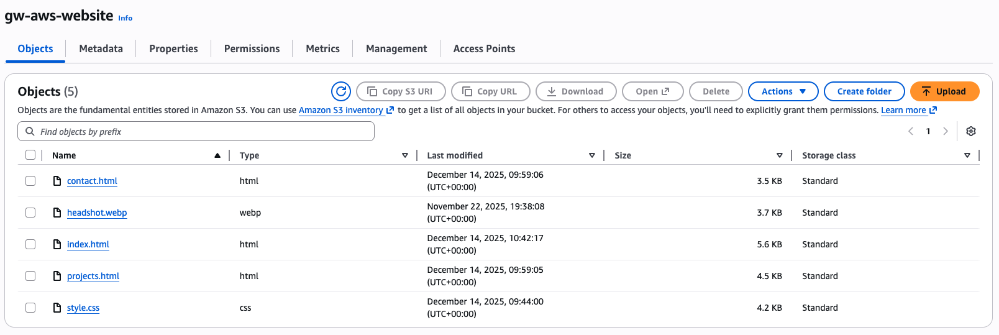
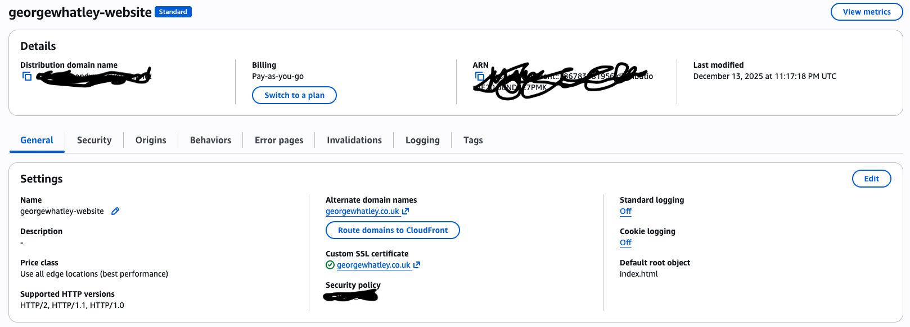
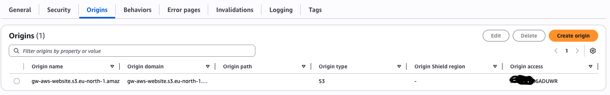
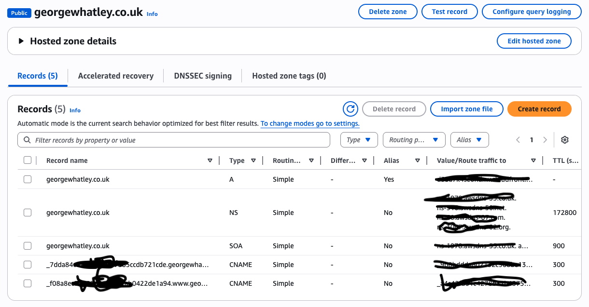

# AWS Cloud Portfolio Website

## Project Overview

I built and deployed a personal portfolio website hosted on AWS to showcase my technical projects and skills. This project demonstrates my ability to work with cloud infrastructure, web hosting, and AWS services.

## Technologies Used
- Amazon S3 (file storage)
- Amazon CloudFront (CDN and HTTPS)
- Amazon Route 53 (DNS/domain management)
- AWS Certificate Manager (ACM)
- HTML/CSS/JavaScript
- Google Analytics

## Project Setup

Here's how I built and deployed the website:

1. I started by learning and following simple tutorials about HTML and CSS since this is my first website I've ever built.

2. Once I had the fundamentals of the code done and felt it was okay to get up and running, I looked for a way to host my website. I took a few things into account: cost, ease of use, and I also wanted something that would help me learn at the same time. There are many "do it for you" website builders, but I wanted to actually understand how it all works.

3. I decided to go with AWS (I chose this over Azure since I want to learn both platforms and already used Azure for my Active Directory project). I looked up ways to get started, and at first I just had it set up with an S3 bucket without a proper domain name or anything. I thought this was good enough, but after digging a bit more I found it was much better to set up everything properly with HTTPS for security, a custom domain through DNS, and CloudFront for content delivery.

4. So I pushed on to set up my domain name and get the website hosted through CloudFront instead of just the standard S3 bucket. This part wasn't easy and took a good while to get it all up and running. I had a bit of a struggle switching from S3 to CloudFront because when I first set it all up I had many settings enabled that shouldn't have been. I figured out I had to disable static website hosting on S3 and let CloudFront handle everything. After this hurdle, everything went smoothly.

5. Now the final things left to do are make sure everything on the AWS side is configured properly and keep updating the code for the website to make sure it's polished.

## Screenshots

### S3 Bucket with Website Files

This shows my S3 bucket containing all the website files (HTML, CSS, images).

### S3 Bucket Permissions

The bucket is set to private with public access blocked since CloudFront handles all access to the files.

### CloudFront Distribution

This shows my CloudFront distribution settings with the custom domain and SSL certificate configured.

### CloudFront Origin

This shows CloudFront is connected to my S3 bucket as the origin for content delivery.

### Route 53 DNS Records

My Route 53 hosted zone showing the DNS records that point my custom domain to the CloudFront distribution.

### Live Website

## Skills Demonstrated

### Technical Skills
- AWS service configuration and management
- Static website hosting with S3 and CloudFront
- Cloud infrastructure deployment
- DNS configuration with Route 53
- SSL/TLS implementation
- Web development (HTML/CSS/JavaScript)
- Content delivery network (CDN) setup
- Analytics integration

### Concepts Applied
- Cloud architecture design
- Infrastructure as a Service (IaaS)
- Content delivery networks (CDN)
- Domain management
- Security best practices (HTTPS, private buckets)

## Challenges and Solutions

### Challenge 1: Switching from S3 Static Hosting to CloudFront
**Issue:** When I first set up the website, I had S3 static website hosting enabled along with CloudFront, which caused conflicts and confusion about which service was actually serving my site.

**Solution:** I learned that when using CloudFront, you should disable S3 static website hosting and keep the bucket private. CloudFront accesses the bucket directly and handles all the public-facing delivery. Once I disabled the S3 website hosting features and configured CloudFront properly, everything worked as expected.

### Challenge 2: SSL Certificate Not Showing Up
**Issue:** I couldn't find my SSL certificate in AWS Certificate Manager and thought it wasn't created properly.

**Solution:** I discovered that SSL certificates for CloudFront must be created in the us-east-1 (N. Virginia) region specifically. I was looking in the wrong region. Once I switched to us-east-1 in the console, I could see my certificate was there and working fine.

### Challenge 3: Learning HTML/CSS from Scratch
**Issue:** This was my first time building a website, so I had to learn HTML and CSS basics before I could even start on the AWS hosting side.

**Solution:** I followed tutorials and practiced with simple layouts first. I focused on getting something functional up and running rather than perfect, knowing I could keep improving the design over time as I learned more.

---

## Live Website

Visit the live site: [georgewhatley.co.uk](https://georgewhatley.co.uk)

## Repository Contents

This repository contains the source code, documentation, configuration details, and screenshots for my AWS-hosted portfolio website.
